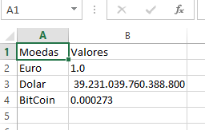

# Cambio com Python
Um script para pegar os valores, via requisição web, das cotações das principais moedas mundiais:
  - Dollar
  - Euro
  - Bitcoin

API utilizada: [FIXER.IO](https://fixer.io/)

### Bibliotecas para funcionamento
```sh
pip install requests
pip install json
pip pandas
```
### Arquivo gerado


### Desenvolvedor

 - Leonardo Cordeiro

License
----
*Free Software!*